# 🎓 Greenfield School ERP

A modern **MERN Stack School ERP (Enterprise Resource Planning) System** built to streamline school management. The application provides secure authentication and a comprehensive dashboard to manage students, attendance, timetable, fees, staff, examinations, academic results, notices, finance, and more.

---

## 🌐 Live Demo

**Frontend:** https://your-vercel-link.vercel.app

**Backend API:** https://your-render-link.onrender.com

---

## 📸 Application Screenshots

### 🔐 Login Page

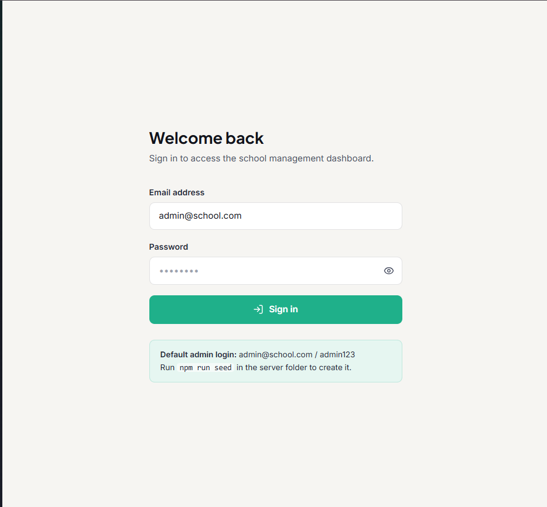

---

### 📊 Dashboard

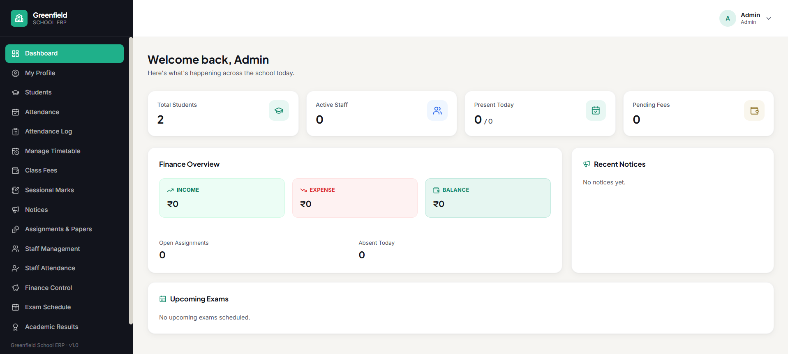

---

### 👨‍🎓 Student Management

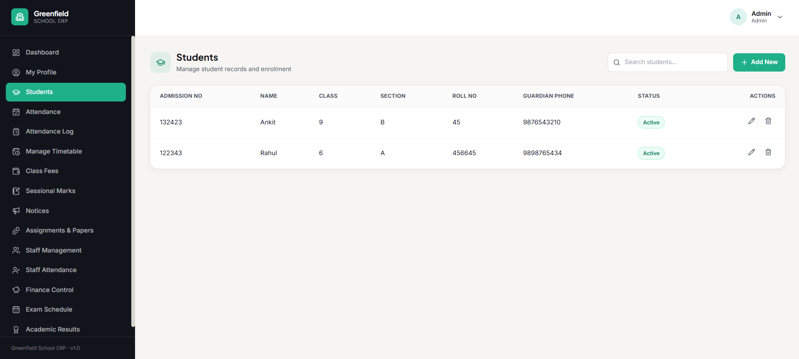

---

### 📅 Attendance Management

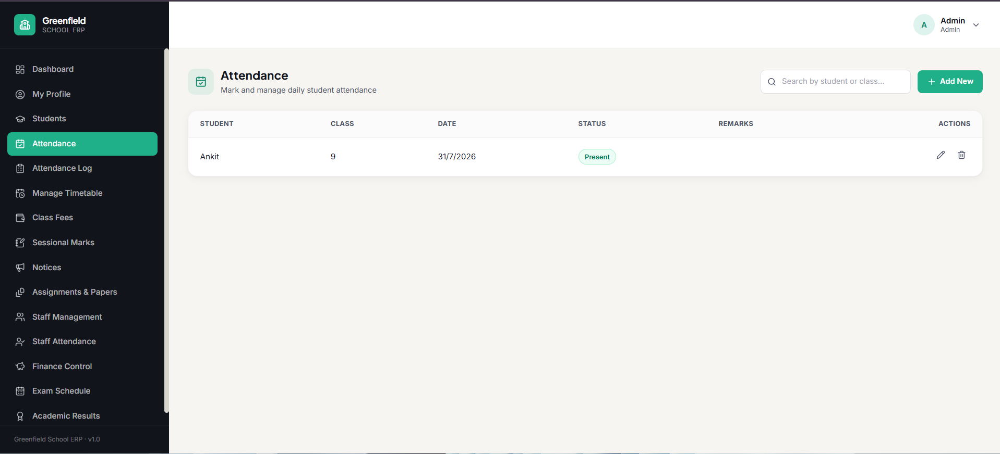

---

### 📋 Attendance Log

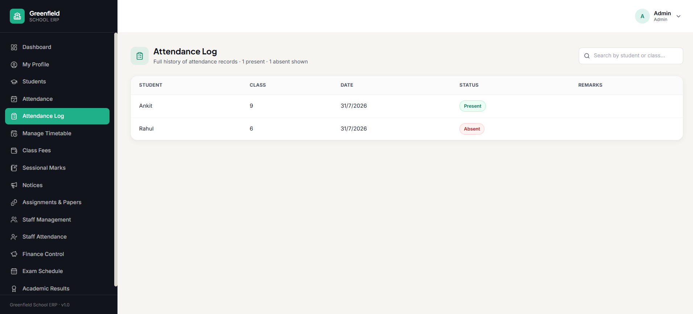

---

### 🗓️ Timetable Management

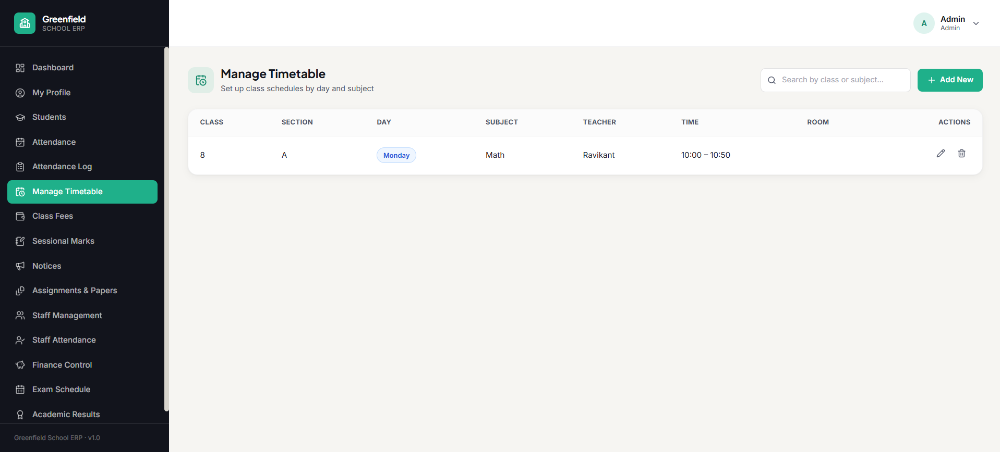

---

### 💰 Class Fees

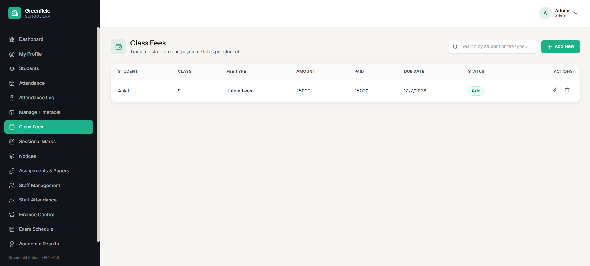

---

### 📝 Sessional Marks

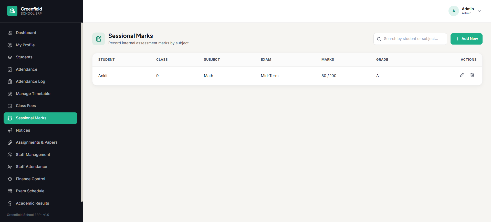

---

### 📢 Notices

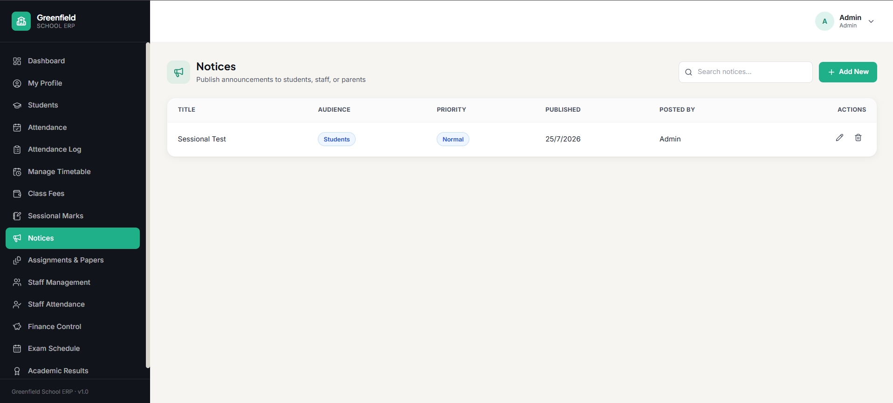

---

### 📚 Assignments & Papers

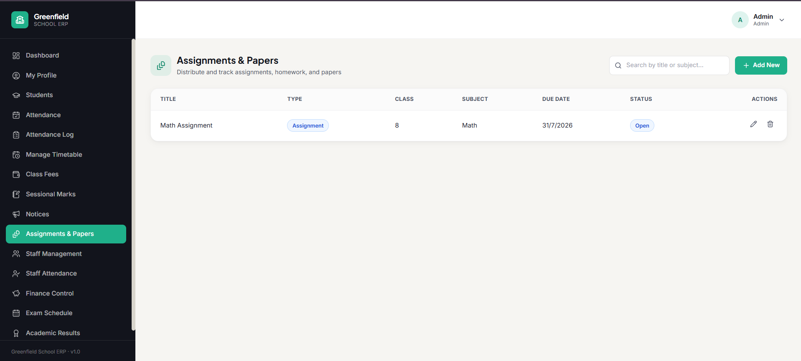

---

### 👨‍🏫 Staff Management

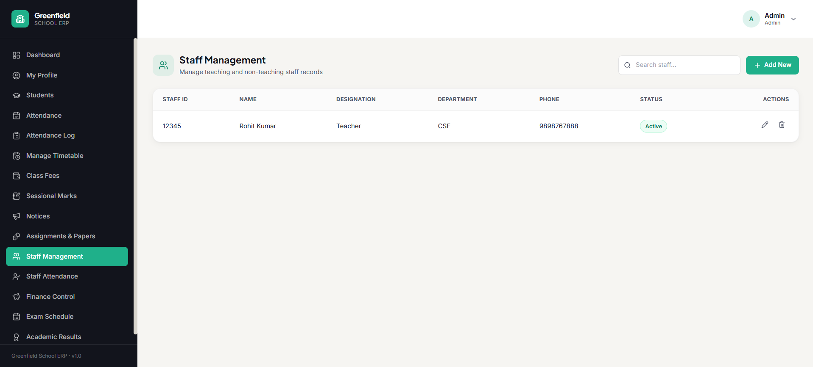

---

### ✅ Staff Attendance

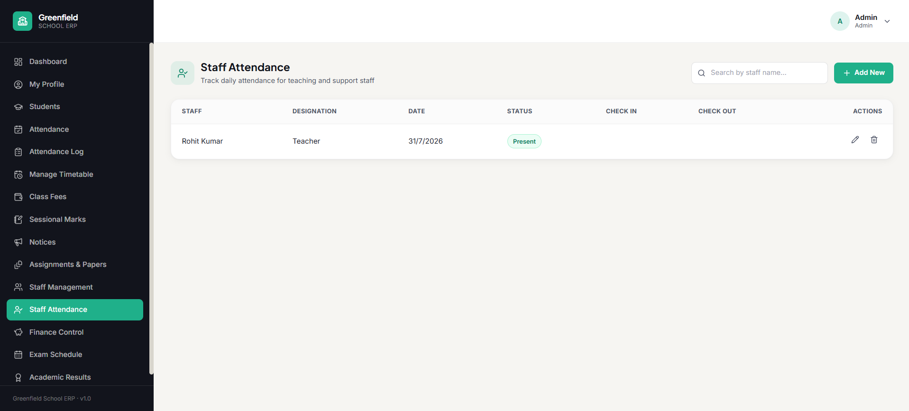

---

### 💵 Finance Control

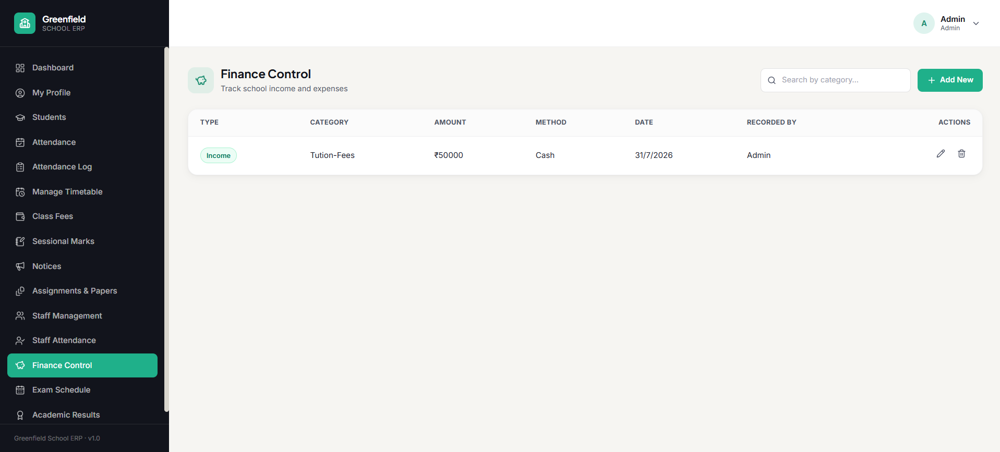

---

### 🧾 Exam Schedule

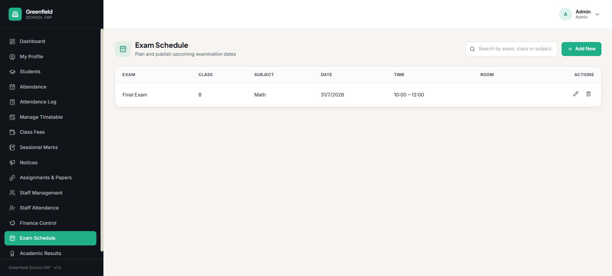

---

### 🎯 Academic Results

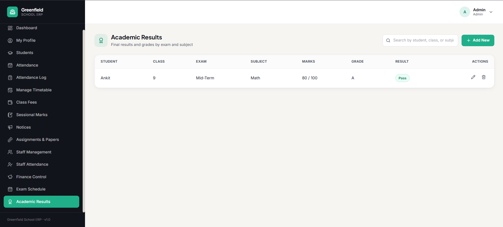

---

### 👤 My Profile

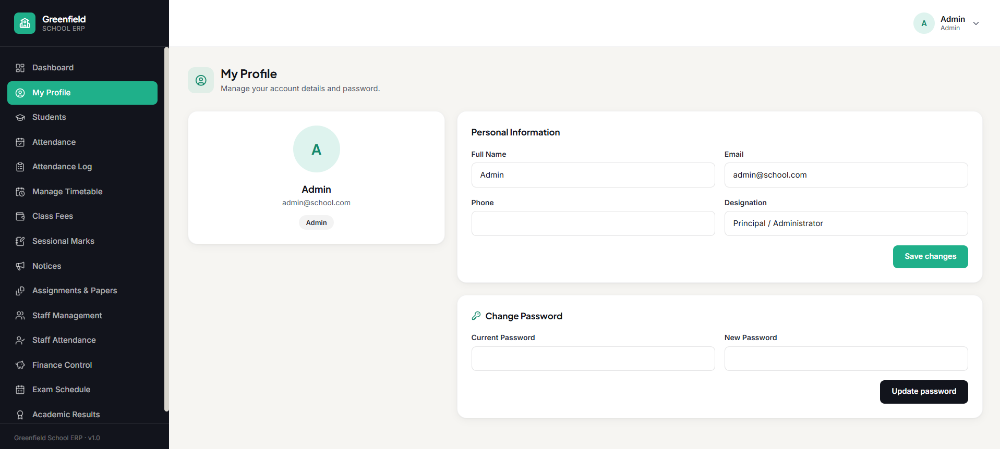

---

## ✨ Features

* 🔐 Secure JWT Authentication
* 👨‍🎓 Student Management (CRUD)
* 📅 Attendance Management
* 📋 Attendance Logs
* 🗓️ Timetable Management
* 💰 Class Fees Management
* 📝 Sessional Marks
* 📢 Notice Board
* 📚 Assignments & Question Papers
* 👨‍🏫 Staff Management
* ✅ Staff Attendance
* 💵 Finance Control
* 🧾 Exam Schedule
* 🎯 Academic Results
* 📊 Dashboard Analytics
* 🔍 Search & Pagination
* 📱 Fully Responsive UI

---

## 📂 Project Structure

```text
student-erp/
│
├── client/                 # React + Vite Frontend
│
├── server/                 # Express + MongoDB Backend
│
├── screenshots/            # Project screenshots
│
└── README.md
```

---

# 🚀 Backend Setup

```bash
cd server
npm install
```

Create a `.env` file:

```env
MONGODB_URI=your_mongodb_connection_string
PORT=5000
JWT_SECRET=your_secret_key
JWT_EXPIRE=7d
CLIENT_URL=http://localhost:5173
```

Seed the admin account:

```bash
npm run seed
```

Default Credentials

```text
Email:
admin@school.com

Password:
admin123
```

Run the server:

```bash
npm run dev
```

Backend URL

```text
http://localhost:5000/api
```

Health Check

```text
http://localhost:5000/api/health
```

---

# 💻 Frontend Setup

```bash
cd client
npm install
npm run dev
```

Create a `.env` file:

```env
VITE_API_URL=http://localhost:5000/api
```

Frontend URL

```text
http://localhost:5173
```

---

# 📦 REST API

| Module           | Endpoint                |
| ---------------- | ----------------------- |
| Authentication   | `/api/auth/*`           |
| Dashboard        | `/api/dashboard/stats`  |
| Students         | `/api/students`         |
| Attendance       | `/api/attendance`       |
| Attendance Log   | `/api/attendance-log`   |
| Timetable        | `/api/timetable`        |
| Class Fees       | `/api/class-fees`       |
| Sessional Marks  | `/api/sessional-marks`  |
| Notices          | `/api/notices`          |
| Assignments      | `/api/assignments`      |
| Staff            | `/api/staff`            |
| Staff Attendance | `/api/staff-attendance` |
| Finance          | `/api/finance`          |
| Exam Schedule    | `/api/exam-schedule`    |
| Academic Results | `/api/academic-results` |

---

# 🛠️ Tech Stack

### Frontend

* React 19
* Vite
* Tailwind CSS
* React Router
* Axios
* Lucide React

### Backend

* Node.js
* Express.js
* MongoDB Atlas
* Mongoose
* JWT Authentication
* bcryptjs

---


Update the following environment variables before deployment:

```env
CLIENT_URL=https://your-frontend-url.vercel.app
VITE_API_URL=https://your-backend-url.onrender.com/api
```

---

# 👨‍💻 Author

**MD ZAID IMAM**

* GitHub: https://github.com/zaidimam15
* LinkedIn: https://www.linkedin.com/in/your-linkedin-profile/

---

## ⭐ Support

If you found this project helpful, please consider giving it a ⭐ on GitHub.
